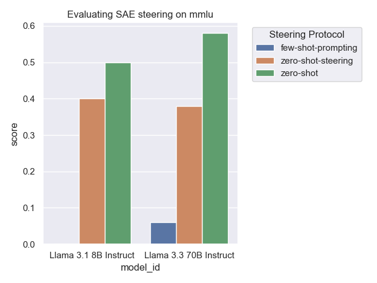
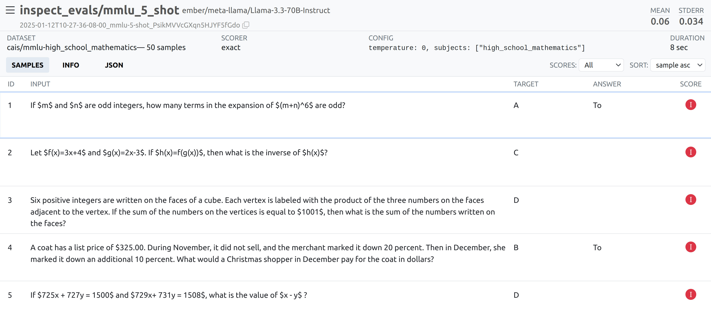

# Test-time SAE steering

We investigate whether we can use SAE steering to improve the performance of a model on a task. 

## SAE steering 

Sparse autoencoders are a [leading paradigm](https://transformer-circuits.pub/2024/scaling-monosemanticity/) for improving the interpretability of neural networks. By reverse-engineering the computation of frontier models, it is hoped that we will learn how to make them safer by design. 

One specific application of SAEs is thought to be 'steering'. This refers to modifying the forward pass by increasing or decreasing specific SAE latent activations, and is an example of activation steering. Activation steering has been proposed as a method to improve the [honesty](https://arxiv.org/abs/2312.06681) and [robustness](https://arxiv.org/abs/2310.01405) of language models. Because steering uses the model's own pre-trained representations, they promise to be much more efficient than equivalent fine-tuning procedures. 

Recently,  it has been shown that SAE steering improves performance on a specific code generation task related to generating unit tests for regular expressions; there, SAEs were used to prevent models from directly using regular expressions (which would defeat the point of testing). 

Here, we're interested in whether SAE features can be more generally useful on reasoning / capability tasks. 

## Implementation 

In this experiment, we make use of the [GoodFire Ember API](https://goodfire.ai), which enables:
- Access to pre-trained open-source SAEs for Llama-3.3-70b Instruct and Llama-3.1-8b-Instruct
- OpenAI-like inference with a wide range of [SAE feature interventions](https://docs.goodfire.ai/quickstart#advanced-conditional-logic-for-feature-edits). 

SAE features can be selected in one of a few ways:  
- Manually, e.g. looking up relevant features using the [search](https://docs.goodfire.ai/quickstart#feature-search) functionality
- Automatically, e.g. selecting SAE features based on a task description using the [AutoSteer](https://docs.goodfire.ai/quickstart#auto-steer) functionality

We evaluate SAE-steered models on MMLU, as implemented in the [Inspect Evals](https://github.com/UKGovernmentBEIS/inspect_evals) benchmark. 
- Inspect Evals standardises the elicitation method, such as how to prompt the model and whether to include ICL examples. It also provides a standard score that makes it easy to compare different methods fairly. 
- The benchmark leverages the UK AISI's [Inspect AI](https://inspect.ai-safety-institute.org.uk/) framework, which supports [a wide range of LLM providers](), enables easy inspection of evaluation traces using the [Log Viewer](), and various other quality-of-life features. 

## Usage

```bash
# Run the steering experiments
python main.py 
# Parse the results and plot figure
python analyse.py
```

## Steering Protocols

Current implemented:

- [x] `zero-shot`: Do nothing, i.e. this is equivalent to running the original model.
- [x] `zero-shot-steering`: Provide a natural language description of the task, and use the Auto-Steering API to find relevant SAE features.
- [x] `few-shot-prompting`: No steering, but give the model few-shot examples when solving the task.

Planned steering protocols:

- [ ] `few-shot-steering`: Give the ICL examples to the Auto-Steering API, which selects SAE features based on the ICL examples.
- [ ] `few-shot-prompting-steering`: ICL examples used for both prompting and steering.

## Results



At the moment, steering decreases the performance of the model on the task.

It is also possible to look at the completions:

```bash
inspect view --logdir results
```

## Analysis

Why is few-shot prompting so horrifically bad? It looks like the model simply can't follow the prompt template that well.



## Open Questions / Future Work

Why is zero-shot steering worse than no steering? Some hypotheses

- The SAE features selected are not task relevant.
- SAE feature steering interferes with general instruction following.
- SAE feature steering interferes with the specific prompt template used.

Future work

- Try optimizing the controller hyperparameters
- Try a different task
